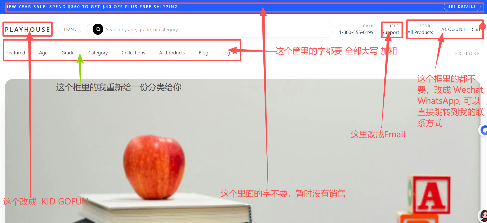

# 本地开发启动指南

## 前置条件

- 已安装 **Docker Desktop** 并处于运行状态
- 已安装 **Node.js**（推荐 18+）
- 项目目录：`D:\codes\111`

---

## 第一步：启动基础服务（Docker）

在项目根目录执行，启动 PostgreSQL 数据库和 Redis：

```powershell
cd D:\codes\111
docker compose up -d medusa-db medusa-redis
```

验证容器是否正常运行：

```powershell
docker ps
```

预期看到 `medusa-db`（端口 5433）和 `medusa-redis`（端口 6379）状态为 `Up`。

---

## 第二步：数据库迁移（首次 / 升级后执行）

数据库迁移用于创建或更新数据库表结构。以下情况需要执行迁移：

- **首次部署**：数据库为空，所有表需要初始化
- **拉取新代码后**：新版本可能包含新的迁移文件
- **添加自定义模块后**：新模块需要创建对应的表

```powershell
cd D:\codes\111\medusa-backend
npx medusa db:migrate
```

迁移完成后每个模块会输出状态，例如：

```
info:    MODULE: product       → Skipped. Database is up-to-date.
info:    MODULE: region        → Ran 3 migrations.
```

> ⚠️ 执行迁移前必须确保 Docker 数据库容器已启动（第一步）。

### 其他数据库相关命令

| 命令                     | 说明                     |
| ------------------------ | ------------------------ |
| `npx medusa db:migrate`  | 执行所有待执行的迁移     |
| `npx medusa db:rollback` | 回滚最近一次迁移         |
| `npm run seed`           | 向数据库填充初始示例数据 |

### 初始化示例数据（首次必做）

**首次启动前**必须执行 seed，否则前端会报 `No regions found` 错误：

```powershell
cd D:\codes\111\medusa-backend
npm run seed
```

seed 脚本会自动初始化以下数据：

- 销售区域（Region）
- 税收区域
- 库存位置与配送方式
- Publishable API Key
- 示例商品数据

> ⚠️ seed 只需执行一次。重复执行不会清空数据，但可能产生重复记录。

---

## 第三步：启动 Medusa 后端

新开一个终端窗口：

```powershell
cd D:\codes\111\medusa-backend
npm run dev
```

等待输出以下内容表示启动成功：

```
✔ Server is ready on port: 9000
info:    Admin URL → http://localhost:9000/app
```

---

## 第四步：启动前端

新开另一个终端窗口：

```powershell
cd D:\codes\111\medusa-frontend
npm run dev
```

启动后访问：http://localhost:8000

---

## 服务地址汇总

| 服务              | 地址                      |
| ----------------- | ------------------------- |
| 前端商城          | http://localhost:8000     |
| 后端 API          | http://localhost:9000     |
| Medusa Admin 后台 | http://localhost:9000/app |
| PostgreSQL        | localhost:5433            |
| Redis             | localhost:6379            |

---

## 关键环境变量文件

| 文件                         | 说明                              |
| ---------------------------- | --------------------------------- |
| `medusa-backend/.env`        | 后端配置（数据库、Redis、JWT 等） |
| `medusa-frontend/.env.local` | 前端配置（后端地址、API Key 等）  |

> ⚠️ 若 `.env.local` 不存在，从模板复制：
>
> ```powershell
> Copy-Item medusa-frontend\.env.local.example medusa-frontend\.env.local
> ```

---

## 停止所有服务

- 前端/后端：在各自终端按 `Ctrl+C`
- Docker 服务：
  ```powershell
  cd D:\codes\111
  docker compose down
  ```
